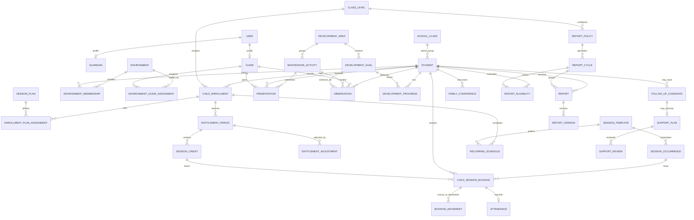

# Montessori Bloom — Target Domain Model & ERD v1

Version: **v1.0**  
Status: **Target architecture baseline / pre-implementation**

## 1. Objective

This document defines the target domain model for Montessori Bloom after the agreed business workflow baseline.

It is intentionally designed for a **modular Laravel monolith**. The model prioritizes:

- traceable scheduling and reschedule history;
- flexible monthly session plans;
- delayed/retroactive attendance;
- Montessori presentation and observation evidence;
- longitudinal child development progress;
- report eligibility based on observation maturity;
- immutable published report versions;
- security boundaries that do not depend on mutable session membership.

This is a target model, not an instruction to drop or rename existing tables immediately.

## 2. Bounded domain areas

The target is divided into eight domain areas.

### A. Identity & Organization

- User
- Guardian
- Guide/Teacher
- AcademicYear
- Term
- AdministrativeClass / SchoolClass

### B. Montessori Environment

- Environment
- EnvironmentMembership
- EnvironmentGuideAssignment
- ChildGuideResponsibility

### C. Enrollment & Service Plan

- ChildEnrollment
- SessionPlan
- EnrollmentPlanAssignment
- EntitlementPeriod
- SessionCredit
- EntitlementAdjustment

### D. Scheduling & Operations

- SessionTemplate
- RecurringSchedule
- SessionOccurrence
- ChildSessionBooking
- BookingMovement
- Attendance

### E. Montessori Curriculum & Evidence

- DevelopmentArea
- DevelopmentGoal / existing Indicator
- MontessoriActivity
- Presentation
- Observation
- DevelopmentProgress

### F. Support & Collaboration

- FollowUpCandidate
- SupportPlan
- SupportReview
- FamilyConference

### G. Reporting

- ReportPolicy
- ReportCycle
- ReportEligibility
- Report
- ReportVersion

### H. Audit

- AuditEvent / domain audit trail

## 3. High-level relationship map



## 4. Existing entities to keep

The following current alpha concepts remain valid and should be evolved rather than replaced.

### `users`

Purpose: authenticated identity.

Target notes:

- no fail-open default admin role;
- authentication identity remains separate from guide/guardian profile;
- authorization increasingly uses policies and contextual assignments.

### `guardians`

Purpose: guardian profile.

Target notes:

- if domain remains one `User -> Guardian`, enforce unique `user_id`;
- child-to-guardian relationship may later need many-to-many if real operations require multiple guardians.

### `teachers`

Purpose: adult/guide profile.

Target notes:

- code may retain model name `Teacher` initially;
- UI/business terminology may use `Guide`;
- contextual roles belong in assignment tables, not only global user role.

### `students`

Purpose: child profile.

Target notes:

- retain administrative class relationship during migration;
- service participation belongs to `ChildEnrollment`;
- environment membership belongs outside the student row;
- sensitive notes require strict policy boundaries.

### `academic_years` and `terms`

Keep as school calendar structure.

Report cycles are separate because reporting may be monthly, bimonthly or term-based.

### `school_classes`

Keep as administrative grouping.

Do not rename directly to environment.

### `class_levels`

Use as the program/level dimension unless implementation discovery proves a distinct `Program` entity is required.

### `development_areas`

Keep.

### `indicators`

Keep initially as developmental goals/indicators.

A later rename to `development_goals` is optional and not required for the first migration.

## 5. Environment domain

### `environments`

Suggested fields:

```text
id
name
code nullable
class_level_id nullable
age_range nullable
capacity nullable
is_active
created_at
updated_at
```

Purpose:

- Montessori prepared environment / community;
- independent from administrative class.

### `environment_memberships`

Suggested fields:

```text
id
environment_id
student_id
valid_from
valid_until nullable
status
created_at
updated_at
```

Recommended invariant:

- no overlapping active duplicate membership for same child/environment period.

### `environment_guide_assignments`

Suggested fields:

```text
id
environment_id
teacher_id
assignment_role
valid_from
valid_until nullable
is_active
created_at
updated_at
```

Possible assignment roles:

```text
LEAD_GUIDE
GUIDE
ASSISTANT
SPECIALIST
```

Do not model these as new global application roles.

### `child_guide_responsibilities`

Optional but recommended when reporting responsibility differs from environment staffing.

Suggested fields:

```text
id
student_id
teacher_id
responsibility_type
valid_from
valid_until nullable
```

Example responsibility:

```text
PRIMARY_GUIDE
REPORT_OWNER
```

## 6. Enrollment domain

### `child_enrollments`

Purpose: service/program enrollment history.

Suggested fields:

```text
id
student_id
class_level_id
starts_on
ends_on nullable
status
first_session_on nullable
suspended_from nullable
suspended_until nullable
created_at
updated_at
```

Recommended statuses:

```text
ACTIVE
SUSPENDED
ENDED
```

Do not delete old enrollment when a child changes program.

### `session_plans`

Purpose: configurable service plan.

Suggested fields:

```text
id
name
code
class_level_id nullable
entitlement_quantity
entitlement_period
preferred_weekly_frequency nullable
makeup_policy_json nullable
rollover_policy_json nullable
is_active
created_at
updated_at
```

Example rows:

```text
Infant Regular 8 | 8 | MONTHLY | 2/week
Glow Regular 4   | 4 | MONTHLY | 1/week
```

Do not store price here.

### `enrollment_plan_assignments`

Purpose: effective-dated plan history.

Suggested fields:

```text
id
child_enrollment_id
session_plan_id
valid_from
valid_until nullable
created_by
created_at
updated_at
```

One enrollment can change plan without rewriting history.

### `entitlement_periods`

Purpose: materialized service entitlement for one period.

Suggested fields:

```text
id
child_enrollment_id
session_plan_id
period_start
period_end
base_quantity
adjusted_quantity
status
created_at
updated_at
```

`adjusted_quantity` may be derived rather than stored if adjustment ledger is authoritative. If stored, reconciliation tests are required.

### `session_credits`

Purpose: one unit of service entitlement.

Suggested fields:

```text
id
entitlement_period_id
sequence_no
origin_period_start
status
created_at
updated_at
```

Recommended states:

```text
AVAILABLE
BOOKED
USED
FORFEITED
```

Avoid state explosion. Detailed movement should come from booking/outcome records.

### `entitlement_adjustments`

Purpose: explicit changes without changing base plan.

Suggested fields:

```text
id
entitlement_period_id
quantity_delta
reason_code
note nullable
created_by
created_at
```

Examples:

- mid-period upgrade;
- courtesy session;
- administrative correction;
- purchased extra session.

## 7. Scheduling domain

### `session_templates`

Purpose: reusable session slot definition.

Suggested fields:

```text
id
environment_id nullable
name
code nullable
day_of_week
starts_at
ends_at
capacity
room nullable
valid_from
valid_until nullable
is_active
created_at
updated_at
```

A school may have around five slots/day, but the number is data-driven.

### `recurring_schedules`

Purpose: a child's normal attendance pattern.

Suggested fields:

```text
id
child_enrollment_id
session_template_id
day_of_week
valid_from
valid_until nullable
is_active
created_at
updated_at
```

This is a pattern, not attendance evidence.

### `session_occurrences`

Purpose: dated operational session.

Suggested fields:

```text
id
session_template_id nullable
environment_id nullable
occurs_on
starts_at
ends_at
capacity
room nullable
status
opened_at nullable
completed_at nullable
completed_by nullable
cancellation_reason nullable
created_at
updated_at
```

Recommended status set:

```text
PLANNED
OPEN
COMPLETED
CANCELLED
```

No `IN_PROGRESS` unless operations actually need it.

### `child_session_bookings`

Purpose: child's allocated slot on a date.

Suggested fields:

```text
id
student_id
child_enrollment_id
session_occurrence_id
session_credit_id nullable
booking_type
status
source_type nullable
created_by nullable
created_at
updated_at
```

Recommended booking types:

```text
REGULAR
RESCHEDULE
MAKEUP
```

Later:

```text
TRIAL
BONUS
SPECIAL
```

Recommended statuses:

```text
SCHEDULED
RESCHEDULED_OUT
CANCELLED
SESSION_CANCELLED
```

Critical invariant:

```text
student + occurs_on <= one ACTIVE booking
```

### `booking_movements`

Purpose: immutable movement relationship.

Suggested fields:

```text
id
student_id
source_booking_id
destination_booking_id
movement_type
reason_code nullable
note nullable
requested_by_type nullable
performed_by
performed_at
created_at
```

Movement type:

```text
RESCHEDULE
MAKEUP
```

A second movement creates another movement row. Do not overwrite the first.

## 8. Attendance domain

### Target `attendances`

Preferred relationship:

```text
child_session_booking_id UNIQUE
```

Suggested fields:

```text
id
child_session_booking_id
status
note nullable
recorded_by nullable
recorded_at nullable
created_at
updated_at
```

Recommended statuses:

```text
UNMARKED
PRESENT
ABSENT
SICK
EXCUSED
LATE
```

Business invariants:

- default is `UNMARKED`;
- session may complete while attendance remains unmarked;
- no deadline;
- no auto-absence;
- historical correction is allowed for authorized users;
- audit old/new values on correction.

Migration note:

Current `class_session_id` + `student_id` fields should remain during compatibility phases.

## 9. Montessori curriculum/evidence domain

### `montessori_activities`

Suggested fields:

```text
id
development_area_id
code nullable
name
description nullable
direct_aim nullable
indirect_aim nullable
sequence_order nullable
is_active
created_at
updated_at
```

Do not overbuild prerequisite graph in MVP.

### `presentations`

Suggested fields:

```text
id
student_id
teacher_id
montessori_activity_id
session_occurrence_id nullable
presented_on
presentation_type nullable
note nullable
created_at
updated_at
```

Presentation answers:

> What was introduced to this child, when and by whom?

It is not an observation score.

### Target `observations`

Keep current observation table and evolve additively.

Recommended fields/concepts:

```text
student_id
teacher_id
session_occurrence_id nullable
montessori_activity_id nullable
development_area_id nullable
indicator_id nullable
observed_on
observation_type
objective_note / note
guide_interpretation nullable
level nullable
needs_follow_up
include_in_report
visibility nullable
```

Do not require every observation to set a development level.

### `development_progress`

Purpose: longitudinal professional judgement, separate from observation.

Suggested fields:

```text
id
student_id
indicator_id nullable
montessori_activity_id nullable
progress_state
judged_by
judged_at
note nullable
created_at
updated_at
```

Recommended state vocabulary remains configurable, but a starting set may be:

```text
NOT_INTRODUCED
PRESENTED
PRACTICING
DEVELOPING
INDEPENDENT
MASTERED
```

This table is not automatically updated from one observation unless explicit business rules later justify it.

## 10. Follow-up/support domain

### `follow_up_candidates`

Suggested fields:

```text
id
student_id
source_observation_id nullable
status
reason_summary
created_by
reviewed_by nullable
reviewed_at nullable
created_at
updated_at
```

Recommended statuses:

```text
OPEN
CONFIRMED
DISMISSED
CLOSED
```

### `support_plans`

Long-term target replacement/evolution of current `ilp_plans` semantics.

Suggested fields:

```text
id
student_id
follow_up_candidate_id nullable
term_id nullable
status
analysis nullable
target nullable
follow_up nullable
starts_on nullable
ends_on nullable
created_at
updated_at
```

Migration strategy should preserve current ILP history.

### `support_reviews`

Optional later:

```text
id
support_plan_id
reviewed_on
reviewed_by
outcome
note nullable
```

## 11. Family collaboration domain

### `family_conferences`

Suggested fields:

```text
id
student_id
conference_on
lead_teacher_id nullable
summary nullable
strengths nullable
areas_to_support nullable
parent_observation nullable
agreed_follow_up nullable
next_review_on nullable
share_with_parent
created_at
updated_at
```

Participants can be normalized later if required.

## 12. Reporting policy domain

### `report_policies`

Purpose: configurable rules per program/level.

Suggested fields:

```text
id
class_level_id
name
reporting_frequency
minimum_observation_days nullable
minimum_attended_sessions nullable
require_guide_confirmation
area_coverage_mode nullable
is_active
created_at
updated_at
```

Example:

```text
Infant Standard
monthly reports
first report after >= 60 observation days
>= 8 attended sessions
guide confirmation required
```

### `report_cycles`

Suggested fields:

```text
id
report_policy_id
name
window_start
window_end
cutoff_date
status
created_at
updated_at
```

Possible statuses:

```text
OPEN
CLOSED
```

`CLOSED` should not mean impossible to correct data; it means ordinary workflow is closed.

### `report_eligibilities`

Purpose: auditable eligibility result for child/cycle.

Suggested fields:

```text
id
student_id
report_cycle_id
initial_eligibility_status
current_readiness_status
observation_days
attended_sessions
criteria_snapshot_json
guide_confirmed_by nullable
guide_confirmed_at nullable
override_by nullable
override_reason nullable
calculated_at
created_at
updated_at
```

This record avoids recomputing historical eligibility with future policy changes.

Recommended initial states:

```text
NOT_ELIGIBLE
ELIGIBLE
```

Recommended readiness states:

```text
NOT_STARTED
EVIDENCE_INCOMPLETE
READY_FOR_DRAFT
```

Workflow states belong on the report itself.

## 13. Report domain

### Target `reports`

Current report records can be evolved.

Recommended fields/concepts:

```text
student_id
report_cycle_id
status
current_draft_payload / existing narrative fields
submitted_at nullable
reviewed_by nullable
reviewed_at nullable
approved_by nullable
approved_at nullable
published_at nullable
created_at
updated_at
```

Recommended workflow:

```text
DRAFT
SUBMITTED_FOR_REVIEW
UNDER_REVIEW
REVISION_REQUESTED
APPROVED
PUBLISHED
ARCHIVED
```

The generic save path must not bypass transition authorization.

### `report_versions`

Purpose: immutable publication/revision snapshots.

Suggested fields:

```text
id
report_id
version_no
payload_json
window_start
window_end
published_by
published_at
supersedes_version_id nullable
created_at
```

Once created, a version must not be edited.

A correction creates another version.

## 14. Audit domain

### `audit_events`

Recommended for critical changes if a generic audit package is not adopted.

Suggested fields:

```text
id
actor_user_id nullable
event_type
subject_type
subject_id
before_json nullable
after_json nullable
metadata_json nullable
occurred_at
```

Minimum audited events:

- attendance correction;
- booking movement;
- capacity override;
- entitlement adjustment;
- report state transition;
- report publication/revision;
- eligibility override;
- sensitive access/administrative changes as required.

## 15. Authorization model

Do not derive broad child access only from session membership.

Target authorization inputs:

```text
Global User Role
+ Environment Assignment
+ Child Guide Responsibility
+ Guardian Relationship
+ Narrow Session Context
+ Record Visibility/State
```

Examples:

### Guide

May:

- see children in assigned environment according to policy;
- manage own/authorized session context;
- create presentations/observations;
- work on assigned reports.

A one-time substitute session does not automatically grant unrestricted access to all historical child records.

### Parent

May:

- see only related children;
- see published/shareable records;
- not see raw internal observations by default.

### Academic lead/admin

May receive broader access based on explicit role/policy rather than accidental relationship traversal.

## 16. Critical database invariants

The target implementation should enforce or test the following.

### Identity

- no default `admin` role;
- unique user/profile linkage if domain is one-to-one.

### Booking

- one active child booking per date;
- destination capacity not exceeded without explicit authorized override;
- rescheduled source remains historical;
- source and destination cannot be the same booking;
- movement chain must not cycle.

### Credit

- one credit cannot back two successfully attended sessions;
- reschedule/makeup normally follows same credit;
- credit origin period never changes;
- adjustment ledger is auditable.

### Attendance

- `UNMARKED != ABSENT`;
- no automatic deadline;
- no automatic absence;
- attendance belongs to exactly one active/historical child booking.

### Report

- parent only sees published/shareable version;
- published versions immutable;
- workflow transitions authorized;
- first report requires policy eligibility unless authorized override.

## 17. Recommended Laravel code boundaries

Target service/application classes may include:

```text
Scheduling/
  GenerateSessionOccurrences
  CreateRecurringSchedule
  RescheduleBooking
  CancelBooking
  CancelSessionOccurrence

Enrollment/
  AssignSessionPlan
  GenerateEntitlementPeriod
  AdjustEntitlement

Attendance/
  RecordAttendance
  CorrectAttendance

Learning/
  RecordPresentation
  RecordObservation
  UpdateDevelopmentProgress

Support/
  CreateFollowUpCandidate
  ConfirmSupportPlan

Reporting/
  EvaluateReportEligibility
  SubmitReport
  ReviewReport
  ApproveReport
  PublishReportVersion
```

Controllers should orchestrate HTTP concerns, not own complex business rules.

## 18. What remains legacy during migration

The following are **not** deleted during initial target implementation:

```text
weekly_schedules
student_weekly_schedule
class_sessions
class_session_student
legacy attendance keys
ilp_plans
term-based report linkage
```

They remain until:

1. backfill passes;
2. reconciliation passes;
3. regression tests pass;
4. UI/API cutover is complete;
5. rollback plan is documented.

## 19. MVP target subset

The full ERD is intentionally broader than the first code tranche.

Minimum structural target for the first operational migration:

```text
environments
environment_memberships
environment_guide_assignments
child_enrollments
session_plans
enrollment_plan_assignments
entitlement_periods
session_credits
session_templates
recurring_schedules
session_occurrences
child_session_bookings
booking_movements
attendance compatibility changes
```

Pedagogical/reporting additions can follow after the scheduling foundation is stable.

## 20. Architecture decision

Montessori Bloom remains a Laravel modular monolith.

The target model deliberately favors:

- explicit relationships;
- immutable history where movement/publication matters;
- effective dating instead of destructive overwrite;
- professional guide confirmation where pedagogical judgement is required;
- deterministic rules before AI.

This target ERD is the reference point for migration planning, not a requirement to ship every entity in one release.
